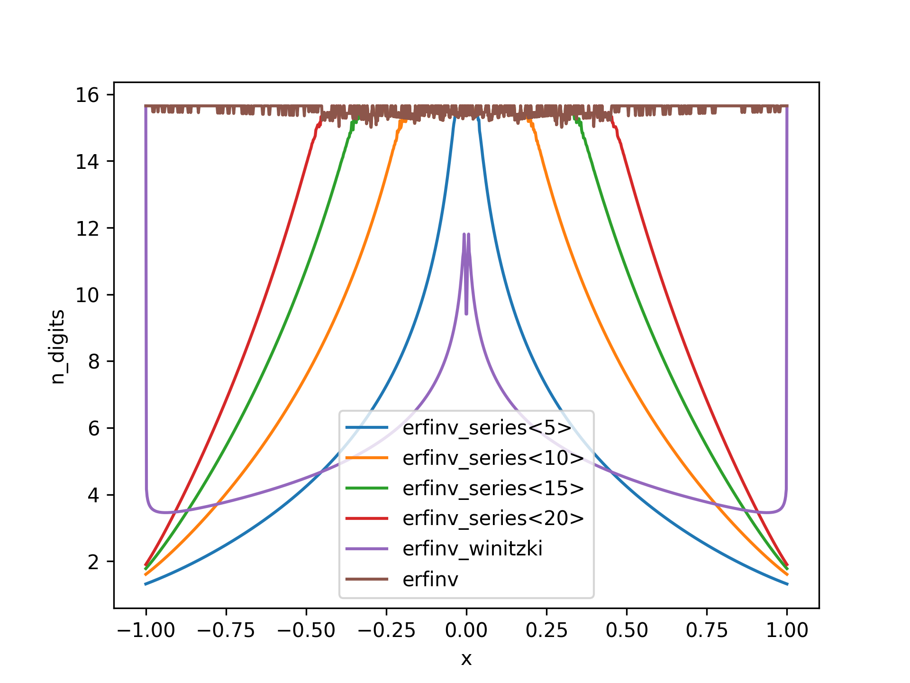

# erfinv_cpp
Compute the inverse of the error function in C++.
The error function `erf` is defined as
$$\text{erf}(z) = \frac{2}{\sqrt{\pi}} \int_0^z e^{-t^2} \mathrm{d}t.$$

It is included in the `<cmath>` header as `std:erf`. Unfortunately, the inverse is missing there.

Here, the inverse `erfinv` is implemented such that
`erfinv(erf(x)) = x`, where `x` is a real number in the inverval `[-1,1]`.

I don't expect this to be optimal in any way, but it's good enough for many use cases.

C++11 is required.

# Installation
Copy the `erfinv.hpp` header into your project.

# Verification
The significant digits have been verified by computing 
$$\text{n\_digits} = -\log_{10} \frac{\text{erf}(\text{erfinv}(x)) - x}{x}$$

To reproduce the verification plots yourself, have a look in the `verification/` folder.

# How
Uses a combination of (i) Taylor series, with coefficients computed at compile time, (ii) a Pade approximant, due to Winitzki [see here](https://www.academia.edu/9730974/A_handy_approximation_for_the_error_function_and_its_inverse), and a few iterations of Newtons method.
